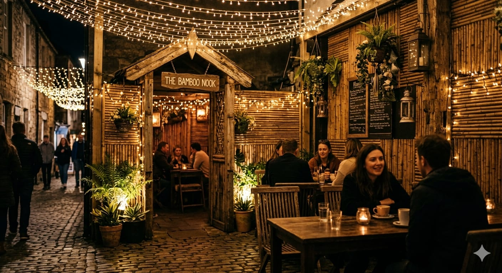

# ☕ Jugnu Cafe — Official Website

> A cinematic, full-featured restaurant website for **Jugnu Cafe** — a cozy cafe in Sambalpur, Odisha, India. Built with Next.js 15 (App Router), TailwindCSS v4, Framer Motion, and TypeScript.



---

## ✨ Features

- **Animated Loading Screen** — branded intro with smooth fade-out
- **Sticky Navbar** — transparent → frosted-glass on scroll, with mobile drawer
- **Hero Section** — full-screen cinematic video background with scroll CTA
- **Experience Section** — highlights the cafe's vibe, ambience, and USPs
- **Special Offer Banner** — scrolling marquee for active deals
- **Menu Section** — tabbed, category-filtered menu with cart integration (Zustand)
- **Cart Drawer** — sliding side-cart with item quantity management and WhatsApp order flow
- **Testimonials** — customer reviews carousel with star ratings
- **Gallery** — CSS grid photo gallery with hover animations
- **Book a Table** — reservation form with date/time/guest-count fields
- **Instagram Section** — live feed embed with follow CTA
- **Map Section** — embedded Google Map + contact details
- **Footer** — links, social icons, and quick info
- **Floating WhatsApp Button** — one-tap order/enquiry
- **Mobile Bottom Bar** — persistent mobile nav with cart badge
- **Fully Responsive** — optimised for mobile, tablet, and desktop

---

## 🛠️ Tech Stack

| Layer | Technology |
|---|---|
| Framework | [Next.js 16 (App Router)](https://nextjs.org/) |
| Language | TypeScript 5 |
| Styling | TailwindCSS v4 + custom CSS tokens |
| Animations | [Framer Motion](https://www.framer.com/motion/) |
| State | [Zustand](https://zustand-demo.pmnd.rs/) |
| UI Primitives | Radix UI (Dialog, Tabs, Slot) |
| Icons | [Lucide React](https://lucide.dev/) |
| Images | Next.js `<Image>` (optimised) |

---

## 🚀 Getting Started

### Prerequisites

- Node.js ≥ 18
- npm or yarn

### Install & Run

```bash
# Clone the repo
git clone https://github.com/Aasim47/jugnu-cafe.git
cd jugnu-cafe/jugnu-cafe-app

# Install dependencies
npm install

# Start the dev server
npm run dev
```

Open [http://localhost:3000](http://localhost:3000) in your browser.

### Build for Production

```bash
npm run build
npm start
```

---

## 📁 Project Structure

```
jugnu-cafe-app/
├── app/
│   ├── globals.css        # Global styles & design tokens
│   ├── layout.tsx         # Root layout (fonts, metadata)
│   └── page.tsx           # Main page composition
├── components/
│   ├── Navbar.tsx
│   ├── HeroSection.tsx
│   ├── ExperienceSection.tsx
│   ├── SpecialOfferBanner.tsx
│   ├── MenuSection.tsx
│   ├── CartDrawer.tsx
│   ├── TestimonialsSection.tsx
│   ├── GallerySection.tsx
│   ├── BookTableSection.tsx
│   ├── InstagramSection.tsx
│   ├── MapSection.tsx
│   ├── Footer.tsx
│   ├── LoadingScreen.tsx
│   ├── MobileBottomBar.tsx
│   └── WhatsAppButton.tsx
├── lib/                   # Shared utilities / store
├── public/
│   └── assets/
│       ├── food/          # Menu item images
│       ├── gallery/       # Ambience & interior photos
│       └── video/         # Hero background video
└── package.json
```

---

## 🎨 Design System

The site uses a warm, dark cafe aesthetic with the following token palette:

| Token | Value | Usage |
|---|---|---|
| `cafe-dark` | `#0a0a0f` | Page background |
| `cafe-cream` | `#f5f0e8` | Primary text |
| `cafe-warm` | `#c4a882` | Secondary text |
| `amber-400` | `#fbbf24` | Accent / CTA |
| `amber-500` | `#f59e0b` | Hover states |

Typography uses **Playfair Display** (display headings) and **Inter** (body) from Google Fonts.

---

## 📬 Contact & Social

- 📍 **Location:** Sambalpur, Odisha, India
- 📸 **Instagram:** [@jugnu_cafe_](https://www.instagram.com/jugnu_cafe_/)
- 💬 **WhatsApp:** Available via the floating button on the site

---

## 📝 License

This project is private and built exclusively for **Jugnu Cafe**. All images and branding assets are property of Jugnu Cafe. Not for redistribution.
